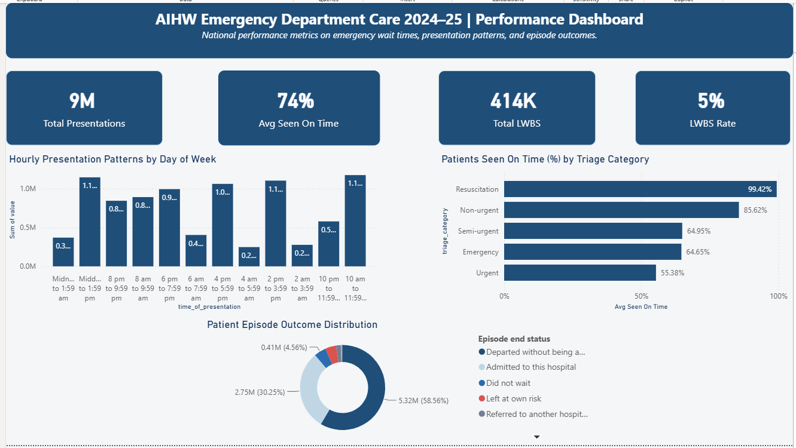

# 🏥 AIHW Emergency Department Care 2024–25 | AI-Augmented Analytics & Executive Dashboard


An end-to-end healthcare analytics project evaluating patient flow, triage performance, wait times, and clinical outcomes across Australian public hospital emergency departments — built as a demonstration of **AI-augmented data analysis**: not code generated by AI and shipped as-is, but a pipeline where AI copilots accelerated execution while a human analyst directed the work, audited every output, and caught the errors that would have shipped otherwise.

This is the difference this repository is built to show: **AI-assisted ≠ AI-verified.** Every stage below documents not just what was built, but what was *checked* — and, in four separate cases, what was *wrong* until someone looked closely enough to catch it.

---

## 📑 Table of Contents
1. [Project Architecture & Stack](#-project-architecture--stack)
2. [Data Source](#-data-source)
3. [Stage 1 — Data Acquisition & Source Structure](#-stage-1--data-acquisition--source-structure)
4. [Stage 2 — Data Engineering (DBeaver / SQL)](#-stage-2--data-engineering-dbeaver--sql)
5. [Stage 3 — Semantic Modeling & Dashboard Design (Power BI)](#-stage-3--semantic-modeling--dashboard-design-power-bi)
6. [Stage 4 — AI-Augmented Analysis, Reporting & Executive Advisory](#-stage-4--ai-augmented-analysis-reporting--executive-advisory)
7. [The Human-in-the-Loop Audit Log](#-the-human-in-the-loop-audit-log)
8. [Key Healthcare Insights](#-key-healthcare-insights)
9. [Repository Structure](#-repository-structure)
10. [How to Reproduce](#-how-to-reproduce)

---

## 🏗️ Project Architecture & Stack

```text
[ Raw AIHW Excel ]  ──►  [ DBeaver / SQLite ]  ──►  [ Power BI Desktop ]  ──►  [ Executive Dashboard ]
 (Unstructured Crosstabs)   (SQL Cleansing & Unpivot)    (DAX & Semantic Model)     ("Hospital Blue" Design)
                                                                    │
                                                                    ▼
                                                    [ AI-Augmented Analysis Layer ]
                                                    (Findings Report + Executive Memo,
                                                     audited against national benchmarks)
```

* **Database & SQL Engine:** DBeaver Community Edition + SQLite (`ED_Analytics.db`)
* **BI & Visual Analytics:** Power BI Desktop (Power Query, DAX Engine, custom theming)
* **AI Copilots:** Claude & Gemini — used across the pipeline for SQL generation, DAX debugging, UI/UX guidance, dashboard file auditing, and executive-level report writing
* **Domain Context:** Australian public healthcare and emergency department operations

---

## 📊 Data Source

* **Source:** Official *Australian Institute of Health and Welfare (AIHW)* report — `Emergency-department-care-2024-25.xlsx`
* **Tables used:**
  * `Table 4.4` — Presentations by hour of day and day of week
  * `Table 5.3` — % of patients seen on time by triage category, hospital peer group, and state/territory
  * `Table 4.12` — Episode end status (Admitted, Discharged, Left Without Being Seen, etc.) by triage category
* **Scope:** Public hospital ED presentations across Australia, 2024–25 reporting period

---

## 📥 Stage 1 — Data Acquisition & Source Structure

The raw file was downloaded directly from AIHW's public reporting portal. On inspection, each relevant tab followed the same problematic structure for analytics purposes:

* A report-title row sitting above the real header row.
* Wide **crosstab** layout — e.g. one column per day of week, or one column per state/territory — designed for human reading, not relational querying.
* Footnote rows, AIHW reference links, and navigation text ("Back to contents") embedded directly beneath the data rows on the same sheet, with no structural marker separating them from real observations.
* Numeric cells formatted with thousand separators (`60,692`) and non-numeric placeholders (`n.p.` = not published, `. .` = not applicable) mixed into otherwise numeric columns.

None of this is visible from a casual open of the spreadsheet — it only surfaces once you try to query it. That gap is the entire justification for Stage 2.

---

## 🗄️ Stage 2 — Data Engineering (DBeaver / SQL)

### Environment setup
A dedicated SQLite database (`ED_Analytics.db`) was created in DBeaver, isolated from unrelated projects, to host the full pipeline.

### Staging
Each target tab was exported to an individual CSV (title row removed) and imported into a staging table — `stg_table_4_4`, `stg_table_5_3`, `stg_table_4_12` — imported one at a time to avoid the import wizard silently merging multiple sources under a shared default table name.

### Unpivoting (tidy-data transformation)
SQLite has no native `UNPIVOT` operator, so each fact table was built with `UNION ALL`, one branch per despivoted column, producing three fact tables:

| Fact Table | Grain |
|---|---|
| `fact_presentations_by_hour` | hour of presentation × day of week × measure |
| `fact_seen_on_time` | hospital peer group × triage category × state/territory |
| `fact_episode_end_status` | episode end status × measure × triage category |

### Cleansing logic applied
* **Thousand separators:** `REPLACE(col, ',', '')` before `CAST(... AS REAL)` — without this, SQLite's cast silently truncated values like `60,692` down to `60` at the first non-numeric character. This was caught by manually comparing a despivoted value against its source cell, not by the AI-generated query itself.
* **Non-numeric placeholders:** `CASE WHEN col GLOB '*[0-9]*' THEN CAST(...) ELSE NULL END`, preserving true `NULL` for `n.p.` / `. .` cells instead of forcing false zeros that would have deflated averages.
* **Noise removal:** footnotes, reference links, and subtotal rows excluded via explicit whitelist filters (`WHERE col IN (...)`) rather than a single `<> 'Total'` exclusion — footnote rows didn't follow any single predictable pattern, so a blacklist approach would have missed them.

Full SQL is in [`/sql/01_staging_and_unpivot.sql`](./sql/01_staging_and_unpivot.sql) and the verification queries used to catch the above issues are in [`/sql/02_data_sanitization.sql`](./sql/02_data_sanitization.sql).

---

## 📈 Stage 3 — Semantic Modeling & Dashboard Design (Power BI)

### Loading
Power BI Desktop has no native SQLite connector. The three cleaned fact tables were exported from DBeaver to CSV and loaded via **Get Data → Text/CSV**, with Power Query auto-detecting the correct numeric types.

### Semantic model
A centralized measures table (`_Measures`) was created to standardize all DAX calculations rather than scattering them across visuals:

```dax
Total Presentations   = SUM(fact_presentations_by_hour[value])
Avg Seen On Time      = AVERAGE(fact_seen_on_time[pct_seen_on_time]) / 100
Total LWBS             = CALCULATE(SUM(fact_episode_end_status[value]), episode_end_status = "Did not wait")
LWBS Rate               = [Total LWBS] / [Total Presentations]
```

### "Hospital Blue" design system
A custom Power BI theme was built specifically for this dashboard, rather than relying on a default palette:

| Element | Value |
|---|---|
| Data / KPI card color | `#1F4E78` (deep navy) |
| Page canvas | `#EBF1F5` (slate) |
| Container background | `#FFFFFF`, 10px rounded borders |
| Accent / bad indicator | `#D9534F` |

The layout was deliberately simplified — a single clean hourly distribution chart instead of a cluttered multi-series view — to keep the dashboard readable at executive-review speed, not just technically accurate.

**Final dashboard visuals:**
- 4 KPI cards: Total Presentations, Avg Seen On Time, Total LWBS, LWBS Rate
- Hourly presentation pattern chart (by day of week)
- Horizontal bar chart: % seen on time by triage category
- Donut chart: patient episode outcome distribution
- 

---

## 🤖 Stage 4 — AI-Augmented Analysis, Reporting & Executive Advisory

This is the stage that distinguishes this project from a standard SQL + Power BI exercise. AI was used not just to generate code, but as an active analytical and quality-assurance layer across the pipeline:

1. **ETL documentation generation** — technical documentation of the full despivot/cleaning methodology, written to be portable between AI tools (used to brief a second copilot, Gemini, on continuing the Power BI build).
2. **Direct `.pbix` file auditing** — rather than trusting a visual screenshot, the packaged Power BI file was programmatically opened and its internal visual query definitions inspected directly, which is how the Stage 3 filter bug below was actually caught (see Audit Log).
3. **National benchmark cross-referencing** — dashboard KPIs were checked against AIHW's own published national figures (live-searched, not assumed from memory) to validate accuracy and surface a methodological discrepancy between a simple triage-category average and a volume-weighted national average.
4. **Findings report** — a structured analysis situating the dashboard's results within Australia's broader emergency care trend (2020–21 to 2024–25), written for external, non-technical audiences.
5. **Executive operations memorandum** — a CMO-facing strategic memo translating the dashboard's metrics into a clinical risk and operations narrative, with short- and long-term recommendations grounded in the underlying data.
6. **Cross-document consistency checking** — when a labeling inconsistency was found between two AI-generated deliverables (admitted vs. discharged percentages swapped in an earlier draft), it was caught and corrected across both documents before being treated as fact.

---

## 🔍 The Human-in-the-Loop Audit Log

The credibility of an AI-augmented workflow rests on what gets *caught*, not just what gets *produced*. Four distinct issues were identified and corrected during this project:

| # | Issue | How it was caught | Impact if shipped uncaught |
|---|---|---|---|
| 1 | Thousand-separator truncation (`60,692` → `60`) in SQL `CAST` | Manual spot-check of a despivoted value against the source workbook cell | Every numeric field in `fact_presentations_by_hour`/`fact_episode_end_status` would have been catastrophically wrong |
| 2 | Footnote/reference-link rows leaking into fact tables as phantom categories | `SELECT DISTINCT` review of each dimension column post-transform | Dashboard categories would include garbage entries like AIHW hyperlinks |
| 3 | Four KPI cards silently filtered to `triage_category = 'Semi-urgent'` only, while supporting charts remained unfiltered | Direct inspection of the `.pbix` file's internal visual query JSON — not visible from the dashboard screenshot alone | The dashboard's "national" KPI cards (9M presentations, etc.) would have actually represented one triage category only, contradicting the dashboard's own subtitle |
| 4 | Admitted vs. discharged episode-outcome percentages swapped in an early report draft | Cross-referenced against AIHW's official national admission rate (~38%) as a plausibility check | A downstream executive memo would have reported an inverted clinical outcome split |

Issue #3 in particular is a useful case study: it was not detectable from the rendered dashboard image — the four cards displayed plausible-looking numbers. It only surfaced by opening the `.pbix` file's internal structure and comparing each visual's query definition line by line. This is the kind of check a screenshot-level review — human or AI — will not catch on its own.

---

## 💡 Key Healthcare Insights

* **9.0M** total ED presentations nationally in 2024–25 (validated against AIHW's official 9.1M).
* **74.0%** average on-time rate across triage categories (simple average — see methodological note below).
* **Triage 3 (Urgent) is the operational bottleneck:** 55.38% on-time, well below Resuscitation (99.42%) and Non-urgent (85.62%).
* **414,000 patients (5.0%)** left without being seen (LWBS) — a material clinical risk exposure, not a rounding footnote.
* **Peak demand:** consistently 10:00 AM–2:00 PM across weekdays.
* **Episode outcomes:** 58.56% discharged without admission, 30.25% admitted to hospital.

> **Methodological note:** the dashboard's 74.0% on-time figure is a simple average across the five triage categories (each weighted equally). AIHW's official national figure for the same period is **67%**, which is volume-weighted — Urgent and Semi-urgent categories, which perform worse, represent far more patient volume than Resuscitation, which performs almost perfectly but is a small share of total presentations. Both figures are correct; they answer slightly different questions, and the dashboard should be labeled accordingly before external distribution.

---

## 📁 Repository Structure

```text
.
├── README.md                                    <-- This file
├── /dashboards/
│   ├── Project_Hospitals_Australia.pbix         <-- Power BI dashboard file
│   └── dashboard_preview.png                    <-- Executive dashboard screenshot
├── /sql/
│   ├── 01_staging_and_unpivot.sql               <-- Staging setup + unpivot transformation
│   └── 02_data_sanitization.sql                 <-- Verification & audit queries
└── /reports/
    ├── ED_Australia_Findings_Report.md          <-- National context & findings brief
    └── ED_Executive_Operations_Memo.md          <-- CMO-facing strategic memo
```

---

## 🛠️ How to Reproduce

1. **Database setup**
   * Open DBeaver, connect to SQLite (`ED_Analytics.db`).
   * Run [`/sql/01_staging_and_unpivot.sql`](./sql/01_staging_and_unpivot.sql) to generate the staging and fact tables (staging CSVs must be imported first — see Stage 2).
   * Run [`/sql/02_data_sanitization.sql`](./sql/02_data_sanitization.sql) to verify row counts, dimension integrity, and the specific bugs documented in the audit log above.
2. **Power BI dashboard**
   * Open `/dashboards/Project_Hospitals_Australia.pbix` in Power BI Desktop.
   * Refresh data sources against the exported CSVs or the SQLite database connection.
   * Before publishing any refresh, re-check each KPI card's **Filters** pane for residual visual-level filters (see audit log, item 3).
3. **Reports**
   * `/reports/` contains the two AI-assisted analytical deliverables produced from the validated dashboard data — useful as a template for turning a BI dashboard into stakeholder-ready narrative documents.

---

**Author:** Cesar Pazo
*Administration & Reporting Professional | Data Analytics in Public Health*
*Melbourne, Australia*
